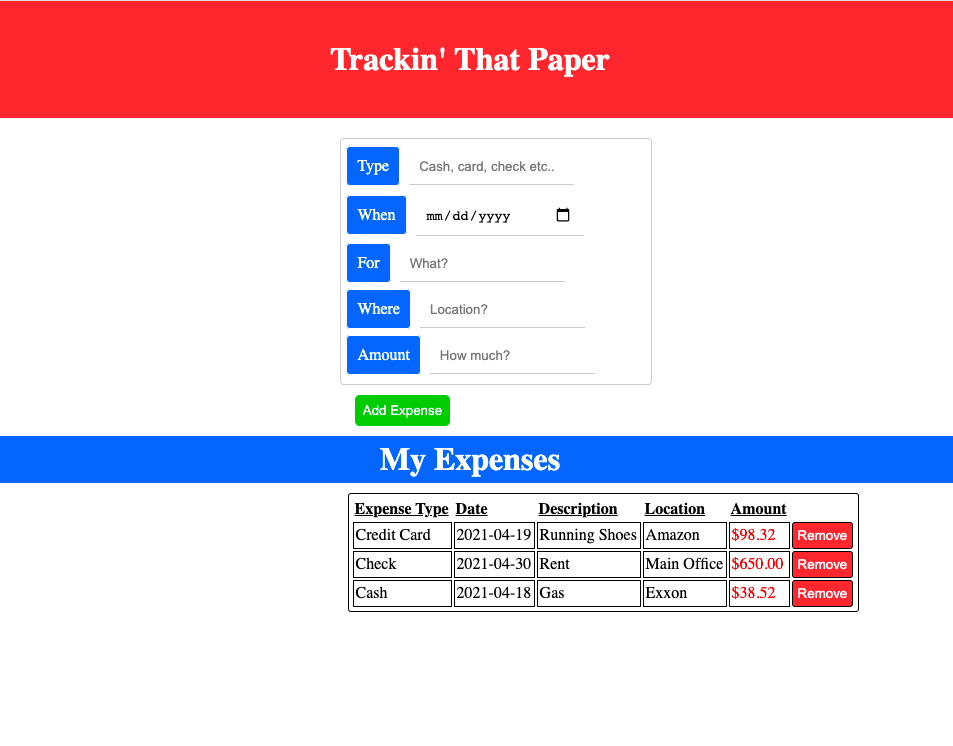

# Expense-Tracker

### This is a simple Expense Tracker app built using HTML CSS and Vanilla JavaScript.
 
#### You can test the app [here](https://beethoven3579.github.io/Expense-Tracker/) 

## Project Summary

While creating this application, I learned how to implement and use the table tag in HTML. I learned how to use 
insertRow() and insertCell() in Javascript. This project also help solidify the use of JSON and Local Storage. The most helpful
and yet challenging aspect of this project was beggining to implement object oriented programming. 

## About Me

Nick Paolino -- Full-Time Programming Student -- [LinkedIn](https://www.linkedin.com/in/nick-paolino-00469291/)
